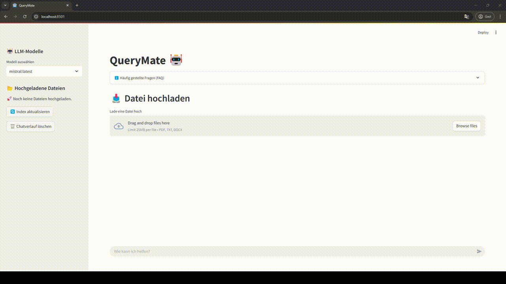

# 🤖 QueryMate2

**A local AI chatbot for company documents**  
> Developed as part of a practical bachelor thesis with a focus on privacy-friendly document retrieval using RAG (Retrieval-Augmented Generation).

---

<p align="center">
  
</p>

## 🔍 Features

- 📄 ** PDF Upload & Processing**  
  Extracts and splits content from uploaded PDFs

- 🧠 **Vector-based Knowledge Retrieval**  
  Document search using [ChromaDB](https://www.trychroma.com/)

- 🔌 **LLM Support (Local)**  
  Uses models from [Ollama](https://ollama.com/)  
  → e.g. `mistral`, `llama3`, `gemma`, `nomic-embed-text`

- 🧬 **Embedding Backend Selection**  
  - HuggingFace (`sentence-transformers`)
  - Ollama (`nomic-embed-text`)

- 💬 **User-Friendly Streamlit Interface**  
  - LLM model selection
  - Uploaded files list + delete option
  - Manual index refresh
  - Contextual Q&A interface

- 📦 Privacy-First & Fully Local  
  - Runs entirely offline, no cloud dependency

---

## 🧱 Project Structure

```plaintext

QueryMate2/
├── backend/
│   ├── chroma_index.py         # Chroma index & vector search
│   ├── ollama_client.py        # LLM requests via Ollama (API or library)
│   ├── embedding.py            # Select and initialize embedding method
│   ├── config.py               # Central configuration
│   └── logger.py               # Logging setup
├── frontend/
│   ├── ui.py                   # Main UI logic (Streamlit)
│   ├── sidebar.py             # Model selector, index actions
│   └── faq.py                  # Help/FAQ sidebar section
├── data/                       # Uploaded PDF documents
├── models/chroma_index/       # Persistent vector index
└── requirements.txt           # Python dependencies
              
```
---

## ⚙️ Installation

### Running the Application

1. Clone the Repository:

```sh
git clone https://github.com/emacs45/querymate2.git
cd querymate
```

2. Create a virtual environment

```sh
python3 -m venv venv
source venv/bin/activate
```

3. Install dependencies

```sh
pip install -r requirements.txt
```

---

### 🚀 Getting Started

#### Launch the Web UI:

```sh
streamlit run frontend/ui.py
```

#### (Optional) Reset and reindex PDFs:
```sh
python backend/chroma_index.py --reset
```

#### ⚙️ Configuration (via config.py or environment variables)

| Variable | Description | Default value |
| --- | --- | --- |
| `OLLAMA_METHOD` | Choose requests or library mode | *library*
| `OLLAMA_URL` | API URL if using requests method | *http://127.0.0.1:11434/api/generate*
| `EMBEDDING_TYPE` | Embedding backend: huggingface or nomic | *huggingface*
| `OLLAMA_MODEL` | Default LLM model | *mistral:latest*

### 🧪 Sample Use Case

Q: “What changes are introduced in the latest software release?”
QueryMate scans your internal documentation and provides a concise summary based on the extracted context.

### 📘 License

MIT License — Free to use for learning, research, or internal company purposes.

---

### 👨‍🎓 About the Project

This chatbot was developed as part of a Bachelor of Science in Business Informatics.
The goal was to prototype an AI assistant for SMEs that runs locally, protects sensitive data, and helps support agents or employees retrieve knowledge from internal documents quickly.

---

### 🙌 Contributions Welcome

Found a bug? Have an idea? PRs and Issues are welcome!